# B2B Toolkit

[](https://github.com/TripleVi/b2b-toolkit)
[](https://www.tampermonkey.net/)

**B2B Toolkit** là một userscript (internal support toolkit) được phát triển nhằm hỗ trợ đội ngũ kỹ thuật và support trong việc debug, kiểm tra và tối ưu hiển thị của ứng dụng BSS B2B trên giao diện Storefront của Shopify.

---

## Installation

### Step 1: Install Tampermonkey Extension
1. Truy cập Web Store trên trình duyệt của bạn (Chrome, Edge, Brave...) và tìm kiếm **Tampermonkey**.
2. Chọn **Add to Chrome** (hoặc trình duyệt tương ứng) để cài đặt.
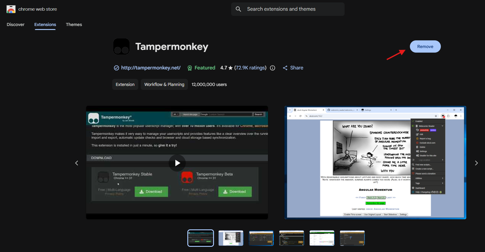
3. **Cấu hình quan trọng cho Extension:**
   * Vào phần quản lý Extension của trình duyệt $\rightarrow$ Chọn **Tampermonkey** $\rightarrow$ **Details**.
   * Tại mục **Site access**, chọn `On all sites`.
   * Bật tùy chọn **Allow User Scripts** (cho phép chạy mã nguồn chưa được kiểm duyệt bởi store nếu có cảnh báo bảo mật).
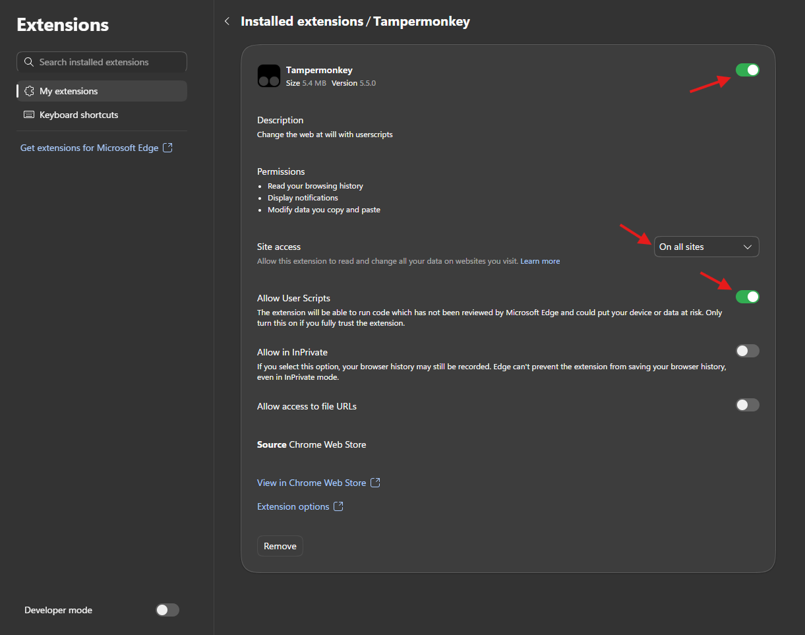

### Step 2: Install B2B Toolkit Script
1. Click trực tiếp vào đường dẫn cài đặt script tự động sau:
   👉 [https://triplevi.github.io/b2b-toolkit/b2b-toolkit.user.js](https://triplevi.github.io/b2b-toolkit/b2b-toolkit.user.js)
2. Giao diện Tampermonkey sẽ hiện ra, nhấn nút **Install** (hoặc **Reinstall**) để hoàn tất.

   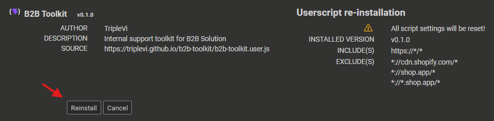

3. Bật script trên website

   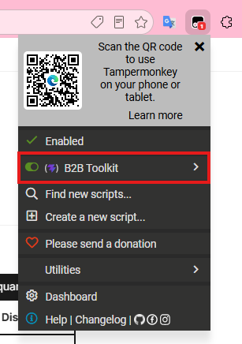

4. Script được inject và chạy thành công trên storefront như sau:

   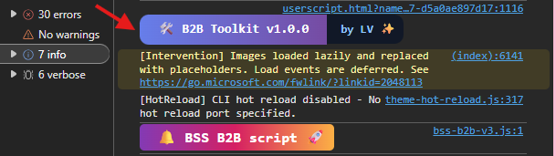

4. Lúc này có thể truy cập tool qua namespace `BSS_B2B.support`.

   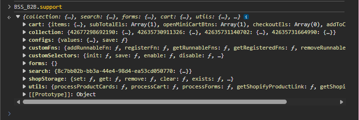

---

## Features

### 1. Highlight Elements & Quick Info
Tự động quét và đóng khung (highlight) các phần tử BSS-selectors phổ biến trên Storefront như: *Product List, Product Form, Cart, Mini Cart, Search Bar, Quick View...*
* **Hover Badge:** Khi di chuột vào các phần tử được highlight sẽ hiển thị badge ở trên đầu tóm tắt thông tin sản phẩm và pricing rule được áp dụng. Có thể truy cập trực tiếp vào Shopify admin.

   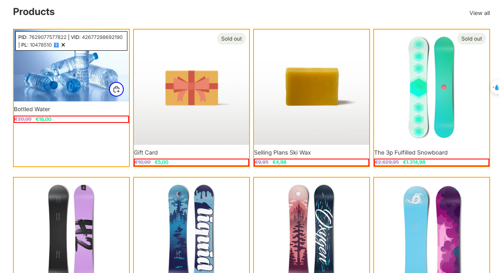

* **Console Log Info:** Khi bấm vào **biểu tượng chữ "i" (info icon)** trên badge, hệ thống sẽ log toàn bộ dữ liệu chi tiết của target đó ra tab Console (bao gồm: `availableRules`, `appliedRules`, `currVariant`, `priceEls`, `related elements`...).

   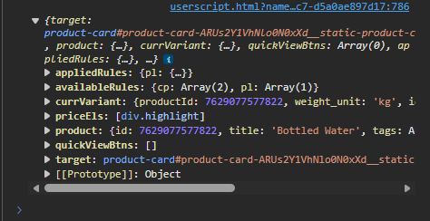

Tương tự cho search bar,

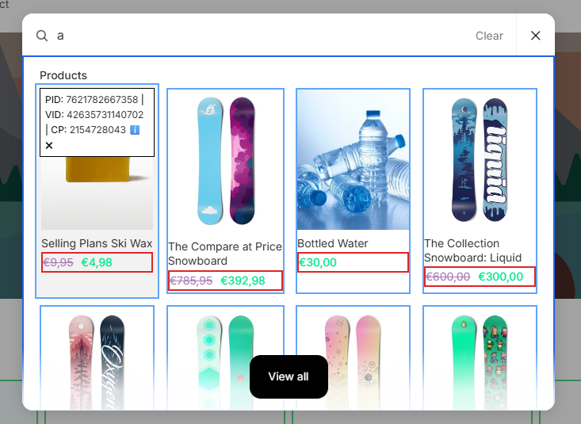

Tương tự cho quick view,

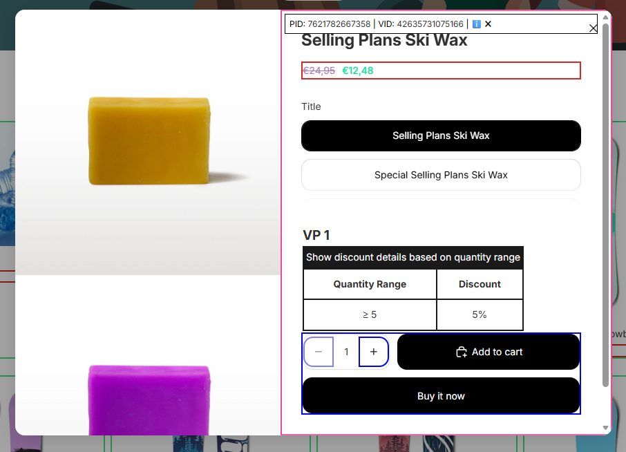

Tương tự cho product form,

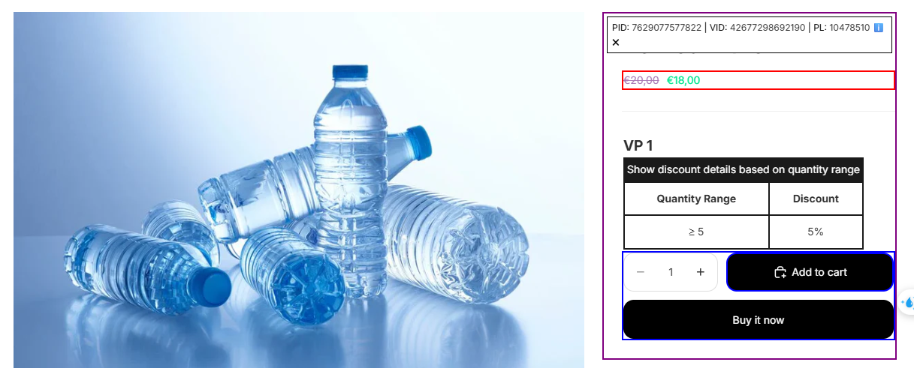

Tương tự cho mini cart,

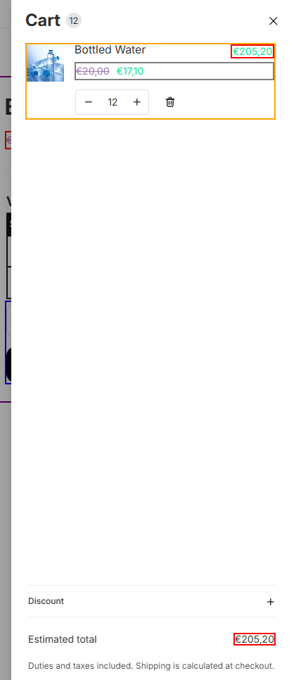

Tương tự cho main cart,

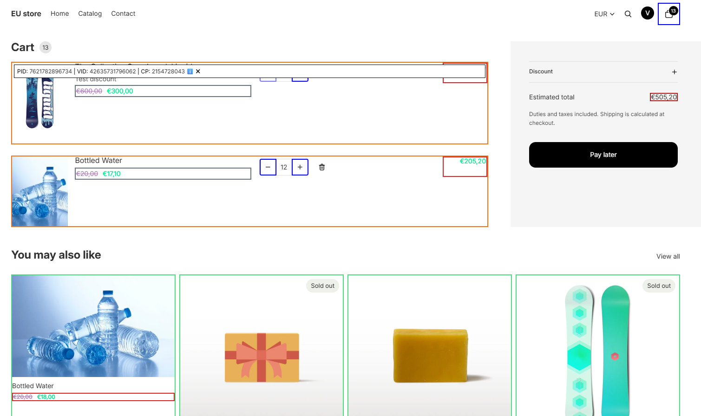

### 2. Event Tracker
Vì app phải tương thích với theme nên không biết khi nào các variant, search, quick view, cart,… handlers được gọi và có được xử lý như mong muốn hay không nên tool sẽ log các event tương ứng kèm info khi chúng được xử lý theo flow của app.
* Hệ thống tự động bắt và log lại các luồng xử lý như thay đổi variant, mở search bar, gọi quick view, cập nhật giỏ hàng... 
* Giúp bạn biết chính xác khi nào các handler được gọi và luồng dữ liệu của ứng dụng chạy có đúng mong muốn hay không.

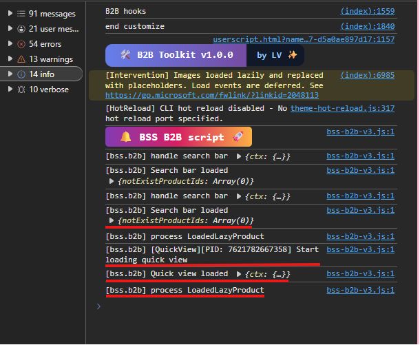

### 3. Custom Selector
Hỗ trợ cài đặt trực tiếp bằng JavaScript từ Console mà không cần chỉnh sửa trong Dev Hub. Chỉ cần cung cấp selector tương ứng. Mọi cấu hình vẫn đi qua hook filter `custom:config_theme/installation`.

Truy cập tính năng thông qua namespace: `BSS_B2B.support.customSelector`.

1. Khởi tạo custom selectors:
   ```javascript
   BSS_B2B.support.customSelector.init()
   ```
   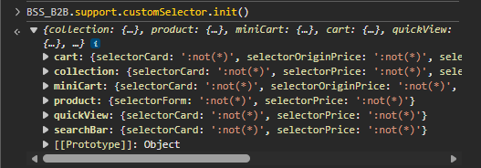
2. Gán giá trị mới cho một component (Ví dụ với `collection`):
   ```javascript
   BSS_B2B.support.customSelector.values.collection = {
       "selectorCard": ":not(*)",
       "selectorPrice": ":not(*)",
       "selectorQuickviewBtn": ":not(*)",
       "selectorSearchBar": ":not(*)"
   }
   ```
3. Lưu lại vào Storage và gọi hàm tương ứng để xử lý và hiển thị lại giá:
   ```javascript
   BSS_B2B.support.customSelector.save()
   BSS_B2B.support.utils.processProductList()
   ```

#### API Reference: `customSelector`
| Function / Property | Description |
| :--- | :--- |
| `values` | Read or write the current custom selectors state object. |
| `init()` | Initialize custom selectors structures and commit them to active storage. |
| `disable()` | Disable the automated selector installation process. |
| `enable()` | Enable the automated selector installation process. |
| `isEnabled()` | Returns a boolean value indicating if automated installation is currently enabled. |
| `isDisabled()` | Returns a boolean value indicating if automated installation is currently disabled. |
| `save()` | Save all modified custom selector adjustments safely into storage. |
| `hasData()` | Returns a boolean value checking if custom selector structures currently exist in storage. |

### 4. Custom Function
Hỗ trợ register and execute các đoạn code tùy biến ngay khi công cụ bắt đầu chạy, giúp inject nhanh các đoạn script test hoặc custom handler.

Truy cập tính năng thông qua namespace: `BSS_B2B.support.customFn`.

#### JavaScript Function Structural Breakdown
Mã nguồn hàm custom cần phải tuân thủ nghiêm ngặt theo cấu trúc cú pháp định nghĩa hàm của JavaScript để tool có thể xử lý và thực thi ổn định:

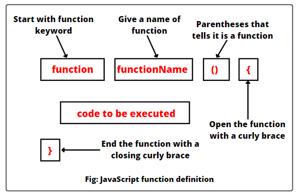

#### Implementation Guide
1. Đầu tiên cần enable tính năng custom function:
   ```javascript
   BSS_B2B.support.customFn.enable()
   ```
2. Đăng ký hàm (`registerFn`): Hàm sẽ được khai báo ở phạm vi global scope nên cần đảm bảo tên hàm (name) là duy nhất.
3. Thêm hàm thực thi ngay (`addRunnableFn`): Hàm này sẽ tự động chạy ngay khi toolkit bắt đầu khởi tạo.

   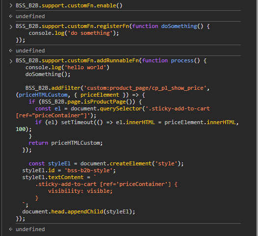

4. Sau đó tiến hành **F5 / Reload** lại website storefront để xem kết quả logs chạy hàm trong tab Developer Console.

   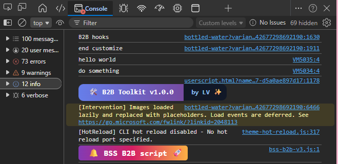

#### API Reference: `customFn`
| Function / Property | Description |
| :--- | :--- |
| `registerFn(fn)` | Registers a named function into the global scope. |
| `addRunnableFn(fn)` | Appends a function block that executes instantly when the tool launches. |
| `getRegisteredFns()` | Retrieves an array containing all currently registered function blocks. |
| `getRunnableFns()` | Retrieves an array containing all currently configured runnable execution structures. |
| `removeRegisteredFn(name)`| Removes a previously declared function block by its string name parameter. |
| `removeRunnableFn(name)`  | Removes an existing runtime runnable entry loop by its matching name parameter. |
| `enable()` | Toggles the custom function features execution subsystem to Active. |
| `disable()` | Toggles the custom function features execution subsystem to Inactive. |
| `isEnabled()` | Returns a boolean checking if the custom function engine is actively processing inputs. |
| `isDisabled()` | Returns a boolean checking if the custom function engine is currently turned off. |

### 5. Tool Configs
Xem và điều chỉnh trực tiếp các cấu hình cốt lõi của hệ thống toolkit (ví dụ: mã màu highlight, bật/tắt highlight của từng cấu phần chi tiết...).

Kiểm tra cấu hình hiện tại bằng cách chạy lệnh sau trên Console:
```javascript
BSS_B2B.support.configs.values
```

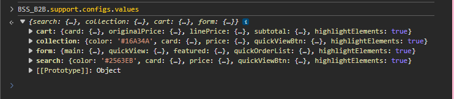

Có thể thay đổi các thuộc tính tùy ý, sau đó gọi hàm sau để lưu cấu hình vào Storage:
```javascript
BSS_B2B.support.configs.save()
```

---

## Other Utils
Cung cấp các hàm tiện ích tính toán, bật/tắt hoặc re-process hiển thị nằm trong namespace `BSS_B2B.support.utils`.

#### API Reference: `utils`
| Function / Property | Description |
| :--- | :--- |
| `processProductList()` | Triggers a baseline scan to refresh, process, and recalculate catalog arrays. |
| `processForms()` | Forces price calculation injections over mapped standard product page forms. |
| `processCart()` | Invalidates and force-updates standard and localized cart row lines. |
| `highlightSearch()` | Targets, overrides, and updates structural markers for search panels. |
| `highlightCollection()` | Highlights product lists matching active variants. |
| `highlightForms()` | Binds highlight borders over tracked buying forms. |
| `highlightCart()` | Isolates and borders active line-item properties within cart nodes. |
| `unhighlightSearch()` | Removes highlight boxes and resets state from active search components. |
| `unhighlightCollection()` | Removes highlight boxes and resets state from catalog/collection lists. |
| `unhighlightForms()` | Removes highlight boxes and resets state from standard checkout product forms. |
| `unhighlightCart()` | Removes highlight boxes and resets state from cart node elements. |

---

## Contributions & Bug Reports
Mọi ý kiến đóng góp phát về bug report hoặc feature improvements, vui lòng thực hiện thông qua các kênh sau:
1. **GitHub Issues:** Tạo Issue trực tiếp tại repo chính thức [TripleVi/b2b-toolkit](https://github.com/TripleVi/b2b-toolkit/issues) kèm theo mô tả lỗi, hình ảnh (nếu có) và log lỗi trên Console Storefront.
2. **Pull Requests:** Nếu bạn đã có sẵn mã nguồn khắc phục hoặc cải tiến, hãy mở PR thẳng vào nhánh `main` để dev review và merge.
3. **Internal Contact:** Đối với các vấn đề nội bộ khẩn cấp trong quá trình support khách hàng của BSS, có thể liên hệ trực tiếp qua hệ thống chat nội bộ.
